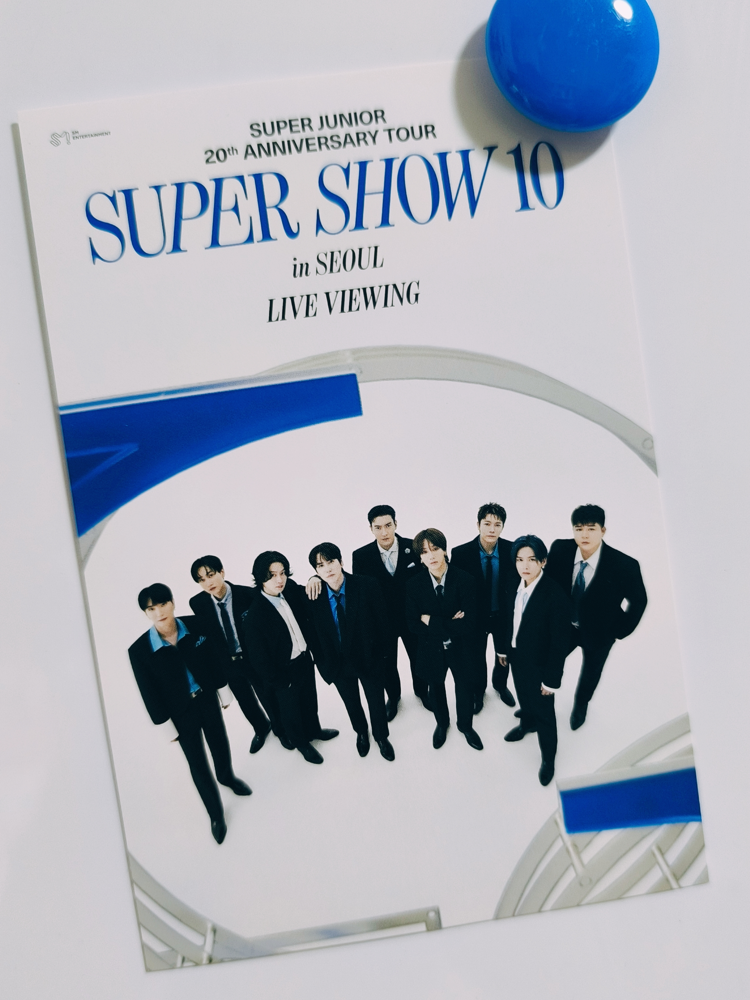

8月が終わる！というか終わった！

日が変わり9月1日。日中が暑すぎるのか、今年の蝉は真夜中に鳴いている。それでも稲刈りの終わった田んぼを見ると確実に季節は変わっていってるのだなと思う。でもこんなに暑い日々からまた寒い冬が来るなんて、当たり前のことなのに実感がわかず、毎年ふしぎに思う。

・

7月8月は仕事がしんどかった。もはや定常業務のイレギュラー業務、下半期から進んでいる業務移管、そして年に2度くる繁忙期。いろいろ重なった。

一番こたえたのは自分のミス。100%自分に非があったわけじゃないし、全部自分でリカバリーやらチェックやらしたけど、上司に手間かけさせたのは間違いないので申し訳ないでいっぱいだった……。

まぁそれも8月で収束し。繁忙期業務に本腰入れて絶賛残業フィーバー中。毎年の業務だけど毎年変化があってマニュアルどおりにいかず厄介。でも、いろんなところのデータ参照して読み解いてっていう作業は嫌いじゃないので、そこまで苦に感じてない。なんだろ、祭りの前日みたいな気分。あれ、それってもはや「楽しい」じゃん……？

・

プライベートはわりと充実していたように思う。ここに書いたこと以外で言えば、、、

ひとつは、すじゅのライビュに行ったこと！金曜の夜に早めに仕事を切り上げ、高速で遠めの映画館にいって。めちゃくちゃ楽しかった〜〜！

相変わらず爆笑させてくれるトーク、相変わらずの長時間戦（20時〜23時半までやってた）、ほぼみんな40代なのに体力どうなってんの？？そして、往年の名曲とパフォーマンスに「懐かしい⋯⋯ッ！！」と悶えたライブだった。あとニューアルバムに収録されてるhaircutが全然想像もしてなかったけど異様な色気があってかっこよかったぞ？！

そして個人的にはヒチョル参加してのスパショが見られる日が来るとは思っていなかったので、本当に本当に嬉しかった。ヒチョルのあのストレート目に下ろした前髪のマッシュヘア（なんていう髪型なんだ）、あれが当時のままで、タイムスリップしたかと思ったわ。

<!-- gallery start -->

<!-- gallery end -->

・

それから、ふらっと寄ったそごうでやってたムーミンポップアップ！めちゃくちゃ可愛くて癒された〜。忘れてたけど、ムーミンバレーパーク、もう落ち着いてるかな。行ってみたいなぁ。
<!-- gallery start -->

<!-- gallery end -->

・

あとは地味に続けている陶板浴、今年は夏もちゃんと通っていて、少しずつ身体に変化があるような感じがしている。昨日からおうちヨガも始めたので、自分の身体と向き合う時間を少しずつ増やしていければと思う。
