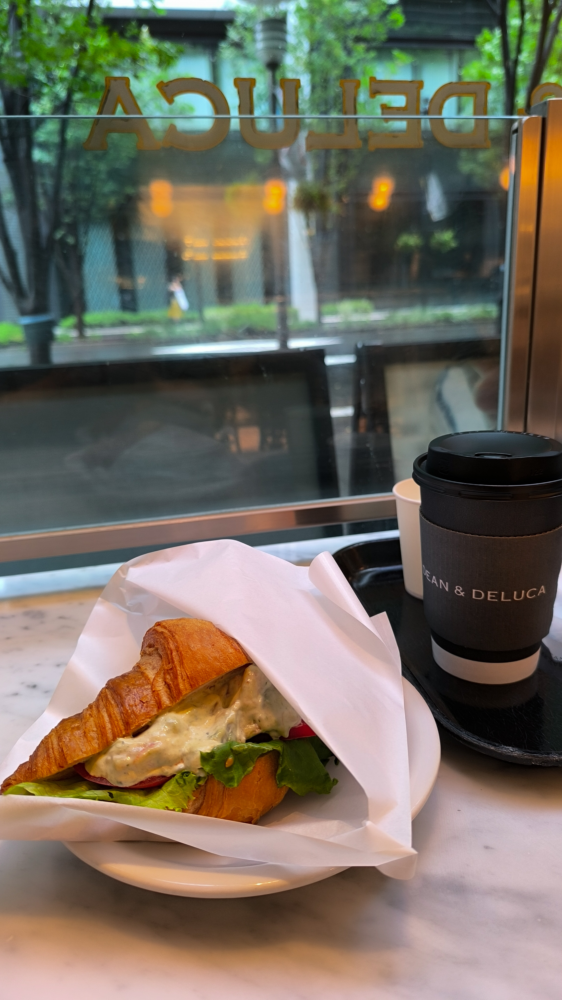
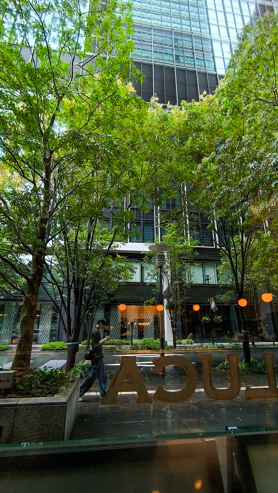
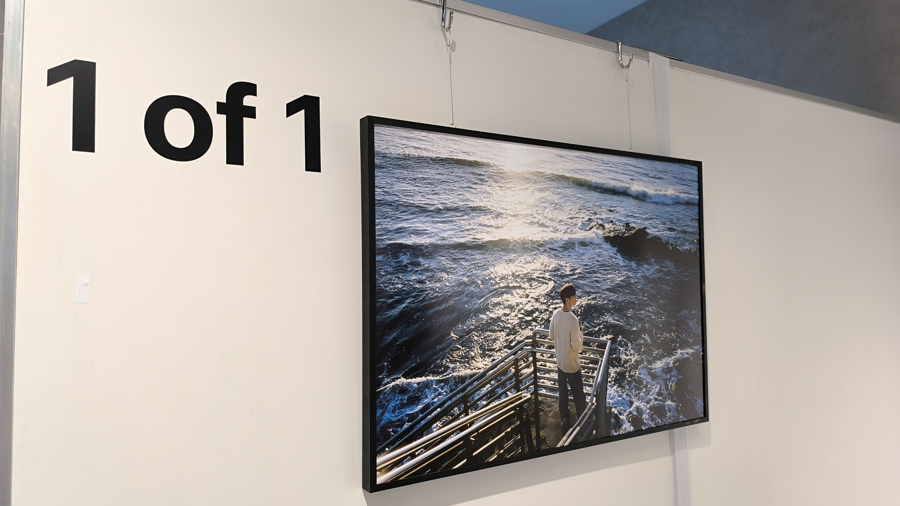
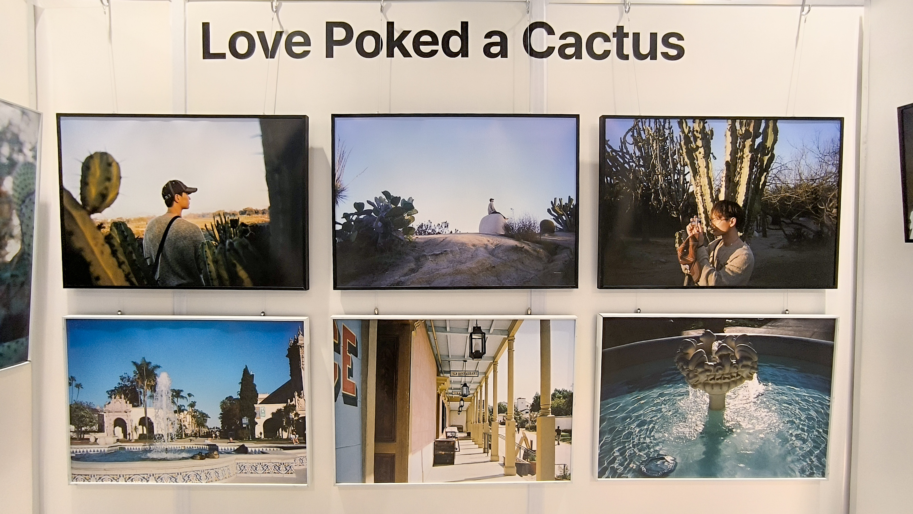
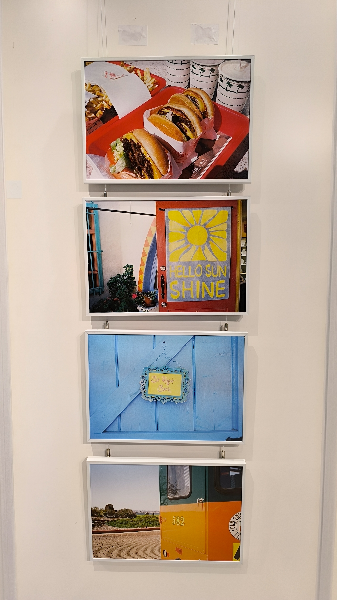
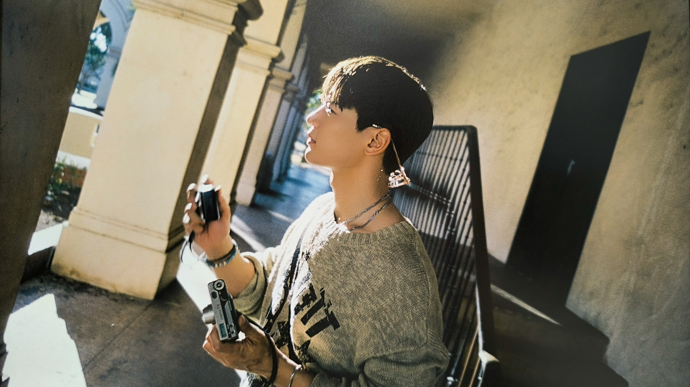

ちぇみのの写真展にいってきた！ 
 
お昼頃まで風が強く雨も降ったり止んだりだったので、DEAN&DELUCAでゆっくりしてから向かった。 
 
そこで食べたクランベリーパウンドが美味すぎて。過去イチのキャロットケーキだわ〜と思ったら、松之助のだった‥。帰ってレシート見て気づいた。また食べに行こう。
<!-- gallery start -->

<!-- gallery end -->
 
そのあと東京から丸の内線に乗り、久しぶりの新宿三丁目。はじめてのマルイメン。 
 
入場から1時間滞在していいので、ゆっくり見れたし沢山写真も撮れた。写真だけじゃなく、動画が流れてたり、メッセージカードを書いて飾る場所もあったり。 
 
写真はサンディエゴで撮影したものらしい。どれも穏やかな空気をまとっているのが、彼のあたたかいところが滲み出てるようだった。 
 
夕陽に照らされる横顔が美しすぎた‥ 
 
なお、販売されてたカタログにはQRコードが載ってて、それを読み込むと、ちぇみの本人の解説が聞けるという‥。最高すぎませんか？最高です。 
 
入場の際、その日本語訳をいただけたので家でもまたゆっくり楽しもうと思う。ありがとう。最高です。 

<!-- gallery start -->

<!-- gallery end -->

私もまたカメラやろうかなぁとか思ったりして。
