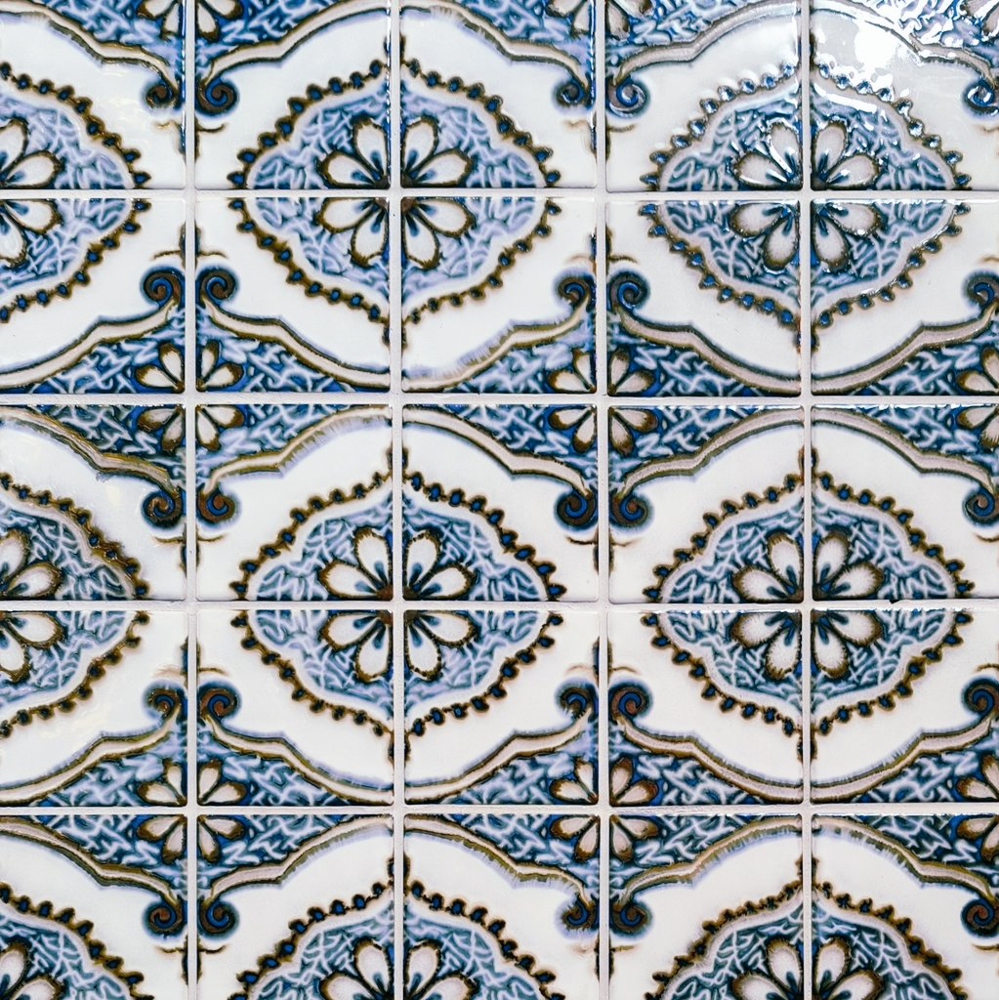

githubのサイトはマジで何もわからないところからChatGPTと喧嘩しながら一緒に頑張って作ったので‥使いたい気持ちあるけど‥

Tumblrはちょうどいいけど周りでやってる人いない
GW頃にgithubでギャラリー作ってもみたけど、投稿が面倒で結局使ってない
インスタに見てほしいものだけちょろっと投稿して、Tumblrを完全なギャラリーとして使うで落ち着きそう

インスタはソーシャル要素強くなってから苦手になってしまった
気が向いたら写真は見てくれたら嬉しい、けど交流はしたくない‥って我儘でしょうか

ワイはinsta360 GO 3Sを買う‥ここ最近ずっとそればっか調べてた‥
写真とか動画撮るならインスタ再開しようかなぁ

もうスケジュールの把握もしてないんだけどSwitch2の第3回抽選外れてました‥
ファンタジーライフに夢中で完全にSwitch2への熱冷めた😂

BECKSのアメリカンめっっちゃ薄いんだけど、この時間に飲むにはちょうどよかったな
ふだん夜はカフェイン控えてるけどｷﾝﾖｰなのでね🌚

会社の飲みだいたい有楽町なんだけど、そこから解散して東京駅まで歩く時間が大好き。高層ビルとネオンと夜風があって。大好きな曲を聴きながら、自分だけの時間って感じで。謎の解放感。 https://t.co/mBmr3ttSUS

